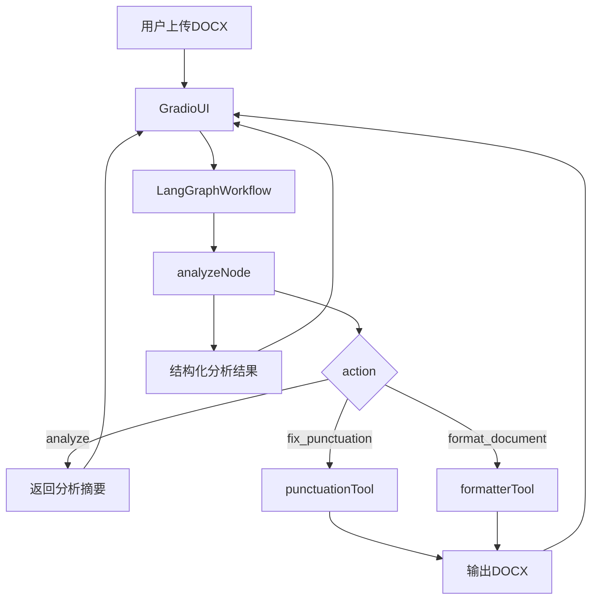

# 项目架构

## 当前目标

本仓库已初始化为单进程 `LangGraph + Gradio` 原型，保留现有 `scripts/` 作为能力来源，通过 `src/doc_demo/` 做统一包装与编排。

## 目录结构

```text
doc_demo/
|-- doc/
|-- scripts/
|-- skills/
|-- output/
|   |-- artifacts/
|   `-- temp/
|-- src/doc_demo/
|   |-- chat/
|   |-- core/
|   |-- graph/
|   |-- skills/
|   |-- ui/
|   `-- utils/
|-- custom_settings.json
|-- main.py
`-- pyproject.toml
```

## 分层职责

- `scripts/`: 历史脚本能力源，当前继续承担核心文档处理逻辑。
- `skills/`: 独立 skill 实现层与同目录说明文件，便于后续复用、上传或迁移。
- `src/doc_demo/chat/`: OpenAI 兼容聊天服务，负责消息组织与 skill 调用循环。
- `src/doc_demo/skills/`: 以 LangChain tool 形式暴露的内置 skill，便于后续替换为真正的项目 skill。
- `src/doc_demo/graph/`: LangGraph 工作流定义，负责分析、路由和执行动作。
- `src/doc_demo/ui/`: Gradio 页面和交互绑定。
- `src/doc_demo/core/`: 共享状态结构和基础模型。
- `src/doc_demo/utils/`: 路径、运行时目录等基础工具。
- `output/artifacts/`: 最终或阶段性产物目录，用于存放修复、格式化等可交付文件。
- `output/temp/`: agent/skill 处理过程中的临时文件目录，用于存放中间态文件。
- `doc/`: 持续维护的架构和演进文档。

## 文件对象约定

当前项目统一把“文件”视为 agent/skill 流程中的一等对象，而不是把文档内容直接展开成 prompt 上下文。

简化约定如下：

1. 输入文件来自用户上传或本地已有路径。
2. 中间处理文件统一写入 `output/temp/`。
3. 可交付结果统一写入 `output/artifacts/`。
4. skill 返回值优先返回文件路径、摘要和下一步建议，而不是仅返回文本。

当前约定中，文档处理实现统一放在 `skills/`，而不是 `src/doc_demo/tools/`。

## 数据流



## 第一版工作流

1. 接收上传文件、动作类型和格式预设。
2. 先执行分析节点，生成结构化问题摘要。
3. 根据动作路由到标点修复或全文格式化。
4. 将分析结果、步骤摘要和输出文件回传给 Gradio。

## 后续演进方向

- 将 `scripts/formatter.py` 拆分为更细粒度服务，减少黑盒调用。
- 将 `scripts/` 中稳定规则提炼为 skill 可复用说明。
- 将 `src/doc_demo/chat/` 接到 Gradio 中，形成可对话入口。
- 若后续需要服务化，再拆分 `ui` 与 `graph` 为独立进程。
